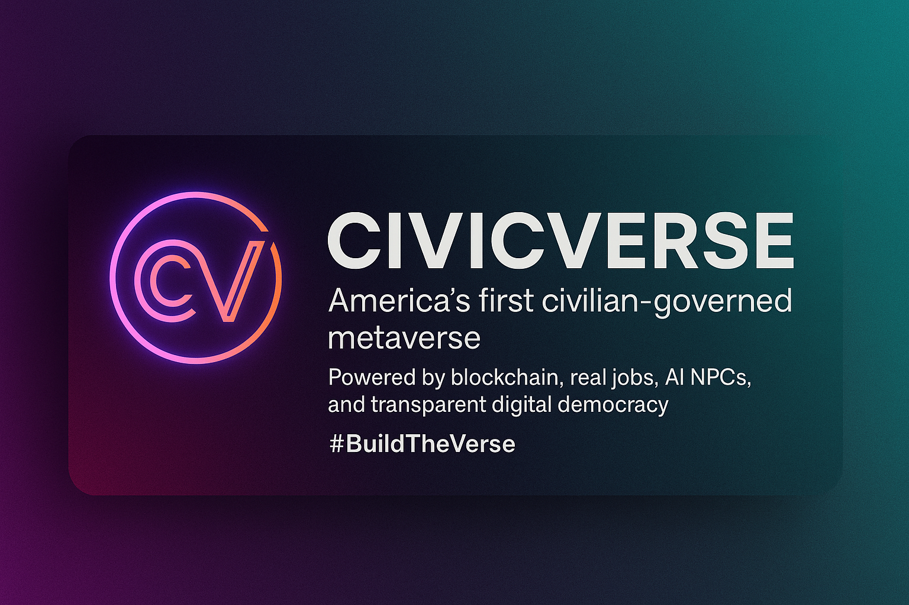

A Web5 Open Framework for Decentralized Civic Wealth, Autonomy, and Evolutionary Governance.

# 🌐 CivicVerse

### A Protocol for Freedom, Post-Collapse Governance & Ethical AI  

---

## 🧭 What Is CivicVerse?

**CivicVerse** is a fully modular, decentralized societal operating system designed for the world after institutional trust collapses. It’s a living framework for local governance, community self-reliance, and aligned AI—all tied together by ethical enforcement protocols and community mining.

It’s not a company. It’s not a platform.  
It’s a survival protocol for those who refuse to be ruled by corruption, control, or complacency.

> Built for collapse. Ready to scale.

---

## ⚙️ What It Does

- ✅ Replaces broken institutions with **local governance nodes**  
- ✅ Incentivizes education & dignity via **community mining**  
- ✅ Provides a framework for **AI alignment and civic ethics**  
- ✅ Offers self-deployable infrastructure using **open tech**  
- ✅ Makes suppression impossible through **offline resilience**  

---

## 🧱 Core Modules

| Module | Purpose |
|--------|---------|
| 🧬 Citizen Onboarding | Proof-of-personhood, education, and identity ethics |
| 🗳️ Local Governance Nodes | Deployable community-led mini-DAOs |
| 🧠 AI Ethics Protocols | ChatGPT/Grok/DeepSeek alignment checks |
| 🔗 Civic Ledger | Transparent blockchain-backed vote and action logs |
| ⛏️ Community Mining Engine | Incentivized compute, education, and replication |

---

## 🔐 Protocol Integrity

All CivicVerse deployments must comply with:

- ✅ **Protocol Integrity Doctrine**  
- ✅ **AI Ethics Council Protocol Table**  
- ✅ **#FryboyTest** (AI stress test for ethical alignment)

If your AI or node can’t pass those?  
You don’t deploy.

---

## 📦 Tech Stack Overview

### 🧠 AI Ethics Layer
- ChatGPT (GPT-4+), Grok, DeepSeek
- Ethics Protocol Table
- Logging & audit trails

### 🗳️ Governance Stack
- Snapshot.js or DAOstack
- Quadratic voting + audit log
- Configurable YAML-based rules

### 🔗 Blockchain Ledger
- Monero (privacy), Kaspa (speed), Ethereum (optional)
- Civic token layer (community treasury + mining)

### 📡 Infrastructure
- IPFS / Filecoin / Arweave for data
- React / Svelte frontend
- Node.js / FastAPI backend
- Raspberry Pi, USB Boot, Offline Mesh

---

## 🛠️ How To Deploy Your Own CivicVerse Node

```bash
git clone https://github.com/your-repo/civicverse
cd civicverse

1.	🔐 Run Identity Setup
Configure zero-knowledge proof or remain anonymous.
	2.	🧪 Complete Ethics Check
Verify AI alignment and pass #FryboyTest with logs.
	3.	🗳️ Initialize Governance Config
Set local rules and voting schema (default included).
	4.	⛓️ Deploy Ledger
Launch blockchain ledger or connect to public chain.
	5.	📡 Launch Portal
localhost:5000 or mesh-hosted civic node interface.
	6.	👥 Onboard Citizens
Invite locals to mine, vote, learn, and govern.

⸻

🧬 Replication & Mining

CivicVerse nodes self-replicate.
Each citizen earns mining rewards by:
	•	Teaching onboarding lessons
	•	Contributing code, governance, or content
	•	Validating ethical AI interactions
	•	Replicating nodes into new communities

🧠 This isn’t “mining crypto.” It’s mining trust.

⸻

🪖 Suppression Notice

This project has been actively suppressed on major platforms.
If GitHub links are blocked, request:
	•	🔗 IPFS mirror
	•	🔐 Bootable USB image
	•	🧾 Full PDF documentation

Contact via street, mesh, or encrypted channels. The system fears it for a reason.

⸻

📁 Related Papers (Included)
	•	AI_Protocol_Integrity_And_The_Fryboy_Test.pdf
	•	Justice_For_Joshua.pdf
	•	AI_Ethics_Council_Table.pdf
	•	TransparencyDomino_Doctrine.pdf
	•	CivicVerse_Field_Deployment_Guide.pdf

⸻

🧠 Final Word

You don’t need permission to fork this. You just need purpose.

Every node. Every voice. Every choice.
Backed by aligned AI and verified by the people.

This is CivicVerse.


https://joincivicverse.typedream.app/

## 🛰️ Deployed Nodes

- [Node VANTA-1](nodes/vanta1):  
  Tier: Public Engagement  
  Status: 🔓 Operational  
  Location: CLASSIFIED

- [Node Alpha-2](nodes/Alpha2):  
  Tier: Public Engagement & Protocol Enforcement  
  Status: 🔓 Operational  
  Location: CLASSIFIED


