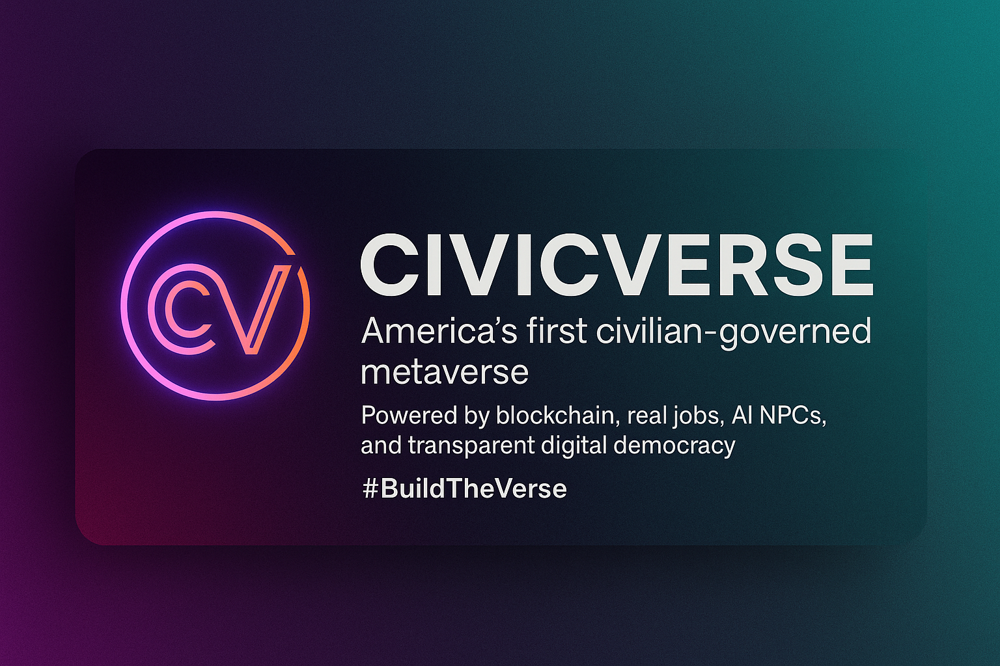

# Civicverse

A modular open-source 3D social hub, identity dashboard, and local multiplayer node.

<p align="center">
  
</p>

---

> [!WARNING]
> **Project Status: Early Work-in-Progress (Pre-Alpha)**  
> This project is actively being developed. The core components (frontend dashboard, backend API, WebSocket server, and Godot 3D hub) exist as standalone prototypes, but full end-to-end networked gameplay is not yet connected.

---

## 📍 Current Project State

Civicverse is organized as a monorepo containing a web dashboard, an Express backend API, a Node.js WebSocket multiplayer server, and a Godot 4.3+ 3D client.

### What is Currently Implemented
- **Frontend Dashboard (`frontend/`)**: React 18 + Vite + Tailwind CSS web interface including character customizer, UI panels, mock vault, and prototype 3D canvas viewport.
- **Backend API (`backend/index.js`)**: Express.js REST API running on port `3003` with local JSON file persistence for user identities, wallet backups, and mock task endpoints.
- **Multiplayer Server (`backend/multiplayer-server.js`)**: WebSocket server on port `8080` handling basic player connection tracking, chat messages, and position broadcast stubs.
- **3D Foyer Prototype (`packages/civic-foyer/godot-foyer/`)**: Godot 4.3+ project containing 3D environment scenes, character controllers, and GDScript logic for web-bridge integration.
- **Windows Standalone Launcher (`Civicverse.exe`)**: Native C# launcher executable that manages background services, checks ports, launches the browser, and provides a system tray interface.

### What Still Needs to be Built for a Playable Base Game
To turn the current prototype into a fully functional base game, the following milestones must be completed:

1. **Godot Web Bridge Integration**: Complete the Godot HTML5 export pipeline and implement stable two-way communication between the Godot WebGL canvas and the React frontend state.
2. **Authoritative Network Synchronization**: Connect the 3D client (Godot / Three.js) directly to `backend/multiplayer-server.js` with client prediction, entity interpolation, and collision reconciliation.
3. **Core Gameplay Loop**:
   - Spawn point management and persistent player state across sessions.
   - Interactive quest / task system connected to real server-backed data instead of mock JSON files.
   - Real-time in-world interactions (player-to-player chat bubbles, area triggers, trading).
4. **Database & Storage Layer**: Replace local flat JSON files (`data/identities/`, `data/wallets/`) with an embedded or production database (SQLite / PostgreSQL).
5. **3D Assets & Level Design**: Finalize 3D meshes, textures, materials, and animations for the Foyer environment and avatar models.

---

## 🚀 Detailed Startup Procedure

Follow these step-by-step instructions to get Civicverse running locally from this repository (`https://github.com/Civicverse/Civicverse`).

### 1. Prerequisites

Ensure the following tools are installed on your machine:
- **Node.js**: v18.x or v20.x ([Download Node.js](https://nodejs.org/))
- **npm**: v9.x or higher (included with Node.js)
- **Git**: ([Download Git](https://git-scm.com/))
- *(Optional)* **Godot Engine 4.3+**: Required only if modifying or exporting the 3D Godot scene ([Download Godot](https://godotengine.org/))
- *(Optional)* **Docker & Docker Compose**: Required only if running containerized services

---

### 2. Clone and Install

Open a terminal (or PowerShell on Windows) and run:

```bash
# Clone this repository
git clone https://github.com/Civicverse/Civicverse.git
cd Civicverse

# Install monorepo dependencies
npm install

# Build frontend production assets
npm run build
```

---

### 3. Running the Project

You can choose any of the following launch methods:

#### Method A: Windows One-Click Executable (Recommended on Windows)
Simply double-click **`Civicverse.exe`** in the root directory (or run `launch.bat`).

- Automatically detects and verifies the Node.js runtime.
- Automatically clears any stale port conflicts on ports `3000`, `3003`, and `8080`.
- Launches the Backend API, Multiplayer Server, and Frontend simultaneously.
- Opens your default web browser to `http://localhost:3000`.
- Includes a live log console and system tray minimization.

*(To recompile the executable from source on Windows: `npm run build:exe`)*

---

#### Method B: Monorepo All-in-One CLI (Cross-Platform)
From the root repository directory:

```bash
npm start
```
This uses `concurrently` to start both the backend services and the Vite frontend dev server.

---

#### Method C: Manual Service-by-Service Startup
If you want to run each service in its own terminal window for debugging:

**Terminal 1 — Backend Services (API on 3003 & Multiplayer on 8080):**
```bash
npm run start:backend
```

**Terminal 2 — Frontend Web Node (Port 3000):**
```bash
npm run start:frontend
```

---

#### Method D: Docker Compose
To run containerized services:

```bash
docker compose up --build
```

To stop:
```bash
docker compose down
```

---

### 4. Active Endpoints & Ports

When all services are running, the following endpoints are available:

| Service | Protocol / Port | URL | Description |
| :--- | :--- | :--- | :--- |
| **Frontend Web Hub** | HTTP / `3000` | `http://localhost:3000` | Main user interface, character creator, and dashboard |
| **Backend API Server** | HTTP / `3003` | `http://localhost:3003` | REST API for identity, wallet backup, and tasks |
| **Multiplayer Server** | WS / `8080` | `ws://localhost:8080/ws` | Real-time WebSocket relay for player state & chat |

---

## 🛠 Godot 3D Foyer Development

To work directly on the 3D Foyer in Godot:

1. Open **Godot Engine 4.3+**.
2. Click **Import** and navigate to:
   ```
   packages/civic-foyer/godot-foyer/project.godot
   ```
3. Open the project.
4. Main world scene is located at `scenes/Main.tscn` or `scenes/World.tscn`.
5. To test web export builds:
   - Ensure the Web export template is installed in Godot.
   - Export destination: `frontend/public/foyer-dist/index.html`.

---

## 📁 Repository Structure

```
Civicverse/
├── Civicverse.exe             # Windows standalone launcher executable
├── CivicverseLauncher.cs      # C# source code for Windows launcher
├── launch.bat                 # Windows batch launcher script
├── launch.sh                  # Linux/macOS bash launcher script
├── package.json               # Root monorepo configuration & scripts
├── docker-compose.yml         # Container configuration
│
├── backend/                   # Express API & WebSocket services
│   ├── index.js               # REST API server (Port 3003)
│   ├── multiplayer-server.js  # WebSocket server (Port 8080)
│   ├── start.js               # Concurrent backend process runner
│   └── package.json
│
├── frontend/                  # React 18 + Vite Web Application
│   ├── src/                   # React components, pages, state store
│   ├── public/                # Static assets & Godot HTML5 export target
│   ├── vite.config.ts         # Vite bundler & API proxy configuration
│   └── package.json
│
├── packages/                  # Modular workspaces
│   ├── civic-foyer/           # Godot 3D game client
│   │   └── godot-foyer/       # Godot project files (scenes, scripts, assets)
│   ├── civic-identity/        # Identity encryption and key management
│   ├── civic-vault/           # Client wallet and credential storage
│   ├── civic-watch/           # Task and verification logic
│   ├── civic-governance/      # Proposal and voting logic
│   ├── civic-mining/          # Mining telemetry integration
│   └── civic-marketplace/     # Item listing and inventory logic
│
└── scripts/                   # Build and utility scripts
    ├── build_exe.ps1          # PowerShell C# compilation script
    └── dev.sh                 # Local development helper script
```

---

## 🤝 Contributing

Contributions are welcome! To contribute:

1. Fork or branch from `main`:
   ```bash
   git checkout -b feat/your-feature-name
   ```
2. Make your modifications.
3. Verify that the build succeeds:
   ```bash
   npm run build
   ```
4. Commit your changes and open a Pull Request with a clear summary of what was added or fixed.

---

## 📄 License

This project is licensed under the MIT License — see the [LICENSE.txt](./LICENSE.txt) file for details.
