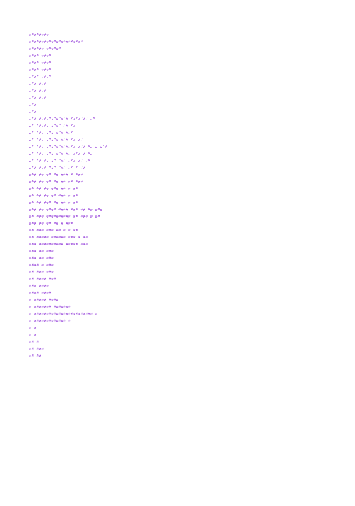

# 🌌 Civicverse v1.3: THE FOYER

<p align="center">
  
</p>

<p align="center">
  <b>The Decentralized Metaverse Coordination Layer</b>
</p>

<p align="center">
  <a href="https://github.com/Civicverse/Civicverse-nightly-v0.0/actions/workflows/ci-cd.yml">
    
  </a>
  
  
</p>

<p align="center">
  <a href="#-getting-started-step-by-step">
    
  </a>
  <a href="#-directory-structure">
    
  </a>
  <a href="./frontend/README.md">
    
  </a>
</p>

<p align="center">
  
  
  
</p>

---

## 🏛 Project Overview
**Civicverse** is a decentralized metaverse coordination layer designed to empower digital humanity. It provides the infrastructure for non-custodial identity, peer-to-peer economic protocols, and a hyper-realistic 3D social hub.

### 🎯 Mission & Aims
- **Decentralized Identity:** Establish a world where identity is recognized by peers, not granted by central authorities.
- **Economic Resilience:** Community-driven resource allocation via the Mining Pool.
- **Coordination Hub:** Build a "Civic Vault" that acts as both a wallet and a character-centric dashboard for navigating the metaverse.

---

## 🚦 System Status

| Component | Status | Description |
| :--- | :--- | :--- |
| **Local CivicID** | ✅ **Working** | Local clientside identity creation, encryption, and vault storage. |
| **Community Mining Pool**| 🛠 In Progress | XMRig integration for XMR mining and real-time telemetry. |
| **The Foyer** | 🛠 In Progress | 3D Hub visuals and basic movement; multiplayer relay in development. |
| **CivicWatch (PoP)** | 🛠 In Progress | Peer-to-peer attestation flow and job-based verification. |
| **UE5 Shards** | 🛠 In Progress | High-fidelity world sharding and additive loading. |

---

## 🚀 Getting Started (Step-by-Step)

### 1. Prerequisites
- **Node.js 20+** & **npm 10+**
- **Docker & Docker Compose**
- **Git**

### 2. Installation
```bash
# Clone the repository
git clone https://github.com/Civicverse/Civicverse-nightly-v0.0.git
cd Civicverse-nightly-v0.0

# Install dependencies for the entire monorepo
npm install
```

### 3. Configuration
```bash
# Copy the example environment file
cp .env.example .env
# Edit .env to add your local configuration if necessary
```

### 4. Local Startup
You can launch all services using the provided script:
```bash
# Give execution permissions
chmod +x launch.sh

# Start the complete stack
./launch.sh
```
Alternatively, start components manually:
```bash
# Start Backend (API & WebSocket)
npm run start:backend

# Start Frontend (Vite Dev Server)
npm run start:frontend
```

---

## 🤝 Contribution Path

We welcome contributors of all skill levels. Here is how you can align with our development path:

### For Developers
1. **Explore the Monorepo:** Familiarize yourself with the `/packages` structure.
2. **Identity Enhancement:** Help improve the `civic-identity` and `civic-vault` packages.
3. **Godot Mastery:** Contribute to the `civic-foyer` Godot project in `packages/civic-foyer/godot-foyer`.
4. **Security Audits:** Help us refine the `security.yml` workflows and audit local encryption methods.

### For Creators
1. **World Building:** Design new 3D shards for the Foyer.
2. **UI/UX:** Refine the Hub aesthetic in the React frontend.

### Workflow
1. **Fork & Branch:** `git checkout -b feature/your-feature-name`
2. **Develop:** Follow the coding standards (TypeScript, Tailwind CSS).
3. **Verify:** Ensure `npm run build` passes.
4. **PR:** Submit a Pull Request with a clear description of changes.

---

## 📂 Directory Structure

- [**backend/**](./backend/README.md) - Node.js API and Socket.io relay.
- [**frontend/**](./frontend/README.md) - React/Vite dashboard and Vault UI.
- [**packages/**](./packages/README.md) - Modular protocol logic (Identity, Mining, etc.).
- [**contracts/**](./contracts/README.md) - Protocol smart contracts.
- [**Ue5_project/**](./Ue5_project/README.md) - Unreal Engine 5 high-fidelity shards.

---
*Identity is claimed through code.*
