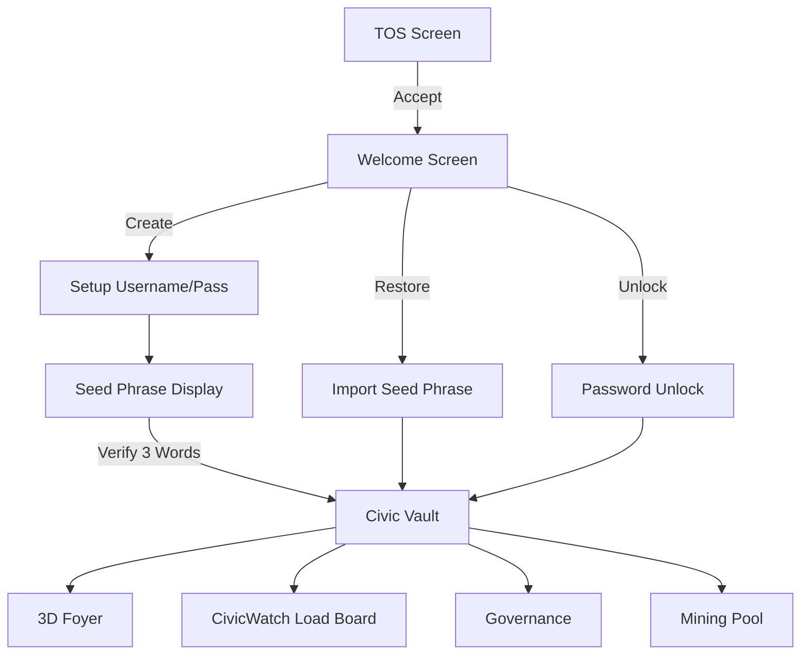

# ∞ CivicVerse: Non-Custodial Identity & Impact Protocol

CivicVerse is a protocol-level infrastructure for decentralized humanity. It enables sovereign identity, peer-to-peer coordination, and a real-world impact marketplace without intermediaries or centralized extraction.

This is the **v1.3-ULTRA** build featuring the **Unified Sovereign Onboarding**, **MMORPG Civic Vault**, and **Community Mining Integration**.

---

## 🧬 How CivicVerse Works (Locked Blueprint)

CivicVerse operates on the principle of **Digital Sovereignty**. Unlike traditional platforms, your identity and assets are generated and stored exclusively on your device.

1.  **Sovereign CivicID**: Your identity is an Ed25519 keypair derived from a BIP-39 memetic seed phrase. You don't "sign up"; you "generate" your presence on the protocol.
2.  **Non-Custodial Vault**: All keys are encrypted locally (AES-256-GCM) and never leave your hardware.
3.  **Proof-of-Personhood (PoP)**: Trust is built through peer-to-peer attestations, not central authority.
4.  **Impact Economy**: Real-world civic actions (CivicWatch) are verified and rewarded via the Community Treasury, funded by the Community Mining Pool.

---

## 🗺 User Journey


```mermaid
graph TD
    A[TOS Screen] -->|Accept| B[Welcome Screen]
    B -->|Create| C[Setup Username/Pass]
    C --> D[Seed Phrase Display]
    D -->|Verify 3 Words| E[Civic Vault]
    B -->|Restore| F[Import Seed Phrase]
    F --> E
    B -->|Unlock| G[Password Unlock]
    G --> E
    E --> H[3D Foyer]
    E --> I[CivicWatch Load Board]
    E --> J[Governance]
    E --> K[Mining Pool]
```

---

## 🏗 Architectural Overview

- **Monorepo Structure**: Managed via NPM Workspaces.
- **Frontend**: React + TypeScript + Three.js + TailwindCSS (Vite).
- **Backend**: Node.js Express API + WebSocket Multiplayer Server.
- **Civic Vault**: An MMORPG-style character dashboard serving as the primary hub for identity, stats, and portal access.
- **Identity**: Local-only, Ed25519-based identity encrypted with PBKDF2 + AES-256-GCM.
- **Mining Pool**: Integrated SupportXMR dashboard for real-time community contribution tracking.

---

## 🚀 Startup Guide

### 1. Prerequisites
- **Node.js**: v20.x or higher.
- **NPM**: v10.x or higher.

### 2. Initial Setup
```bash
git clone https://github.com/Civicverse/Civicverse-nightly-v0.0.git
cd Civicverse-nightly-v0.0
npm install
```

### 3. Spinning it Up
```bash
npm start
```
- **CivicVault/Frontend**: [http://localhost:5173](http://localhost:5173)
- **API Terminal**: [http://localhost:3003/api/status](http://localhost:3003/api/status)

---

## 🛠 Roadmap: v1.3+ Operational Blueprint

### 🟢 Short-Term (1–2 Weeks)
- **PoP Implementation**: Add "Verify Your CivicID" flow with 3-peer attestation logic.
- **Vault Enhancements**: Connect reputation/skills to real CivicWatch contribution metrics.
- **Offline Resilience**: Transition to PWA (Service Workers) and implement local action queuing.
- **Vault Tools**: Implement QR-code based CivicID export and encrypted JSON backup.

### 🟡 Medium-Term
- **Ollama AI Enforcement**: Local AI service for governance rule execution and mission validation.
- **CivicWatch Evolution**: Live Leaflet/Three.js map with geo-verification and payout simulations.
- **IPFS Integration**: Anchoring mission proofs and identity metadata to decentralized storage.
- **Social Recovery**: UI for 3–5 guardians with threshold encryption hints.

### 🔴 Long-Term
- **Hardware Integration**: Full Raspberry Pi node support with Mesh/LoRaWAN sync.
- **L2 Governance**: Ethereum L2 + zkSNARKs for anonymous voting and treasury transparency.
- **UE5 Bridge**: Portals to persistent high-fidelity shards via UE5 Foyer bridging.
- **UBI Engine**: Fully governed 1% micro-tax routing to protocol citizens.

---

## 💎 Support the Vision
Every bit of hashpower contributed to the **Community Mining Pool** directly funds the **Community Treasury**. 1% of all pool proceeds are routed to fund real-world missions deployed on the CivicWatch board.

**Build for humanity. Own your future.**
