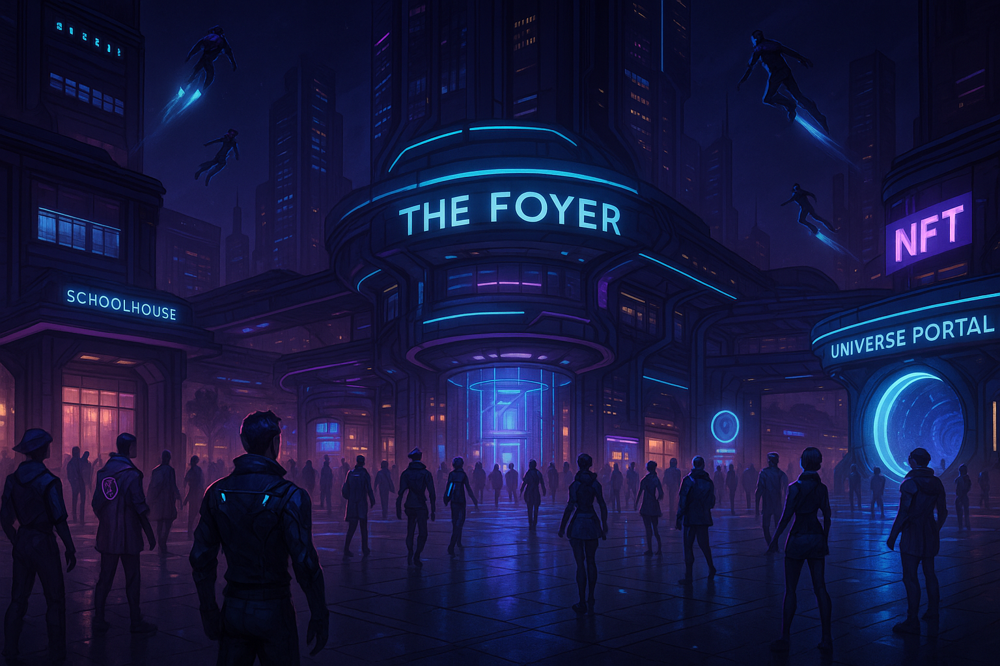

# 🏛️ The Foyer — CivicVerse Lobby City

> Think **Conton City** from *Xenoverse 2* meets **GTA Online** meets the **Sims** 
> But the lobby actually **does** something—and it’s **planned for Unreal Engine 5**.

Welcome to **The Foyer** — the immersive multiplayer lobby city where your **CivicWatch avatar** enters the CivicVerse. But this isn’t just a spawn zone—it’s a decentralized, living, evolving city that blends gaming, civic duty, and real-world infrastructure.

Planned for full deployment in **Unreal Engine 5**, The Foyer is a persistent, high-fidelity, civilian-owned multiplayer space—where **real-world actions shape digital reputation** and **digital identity unlocks real-world power**.

This isn't just another online game.

> 🎮 It invites indie devs, educators, and studios to **build immersive worlds** that matter.  
> 🌍 It’s changing video games for the first time since the leap to 3D.

---

## 🧬 Avatar Carryover From CivicWatch

You arrive in The Foyer as who you've *earned* the right to be.

- ✅ Stats & history from real-world CivicWatch missions  
- ✅ Soulbound NFT = proof-of-personhood + civic rep  
- ✅ Wearables, gear, and reputation-based cosmetics  
- ✅ DAO weight, faction karma, skill trees  
- ✅ Fully modular—your identity travels across portals and worlds

Your avatar is your **civic passport, gamer card, and public key**—in one.

---

## 🏙️ Core Systems in The Foyer

### 🛍️ Real Commerce, Real Ownership

Everything you buy—digital or physical—grows the system.

- Digital wearables and cosmetics for your avatar  
- Physical merch **shipped to your door**  
- NFT banners, badges, and stat cards for your public profile  
- Resellable gear and cosmetics via CivicVerse market  
- **1% microtax** on all purchases funds UBI, mission rewards, and local wallets

> Every transaction is civic-powered. No ad targeting. No corporate skim.  
> Just real money—reinvested into real community infrastructure.

---

### 🧑‍🏫 Schoolhouse
- Educators earn crypto to teach in UE5 classrooms  
- Students unlock real-world credentials, skills, and DAO voting power  
- No debt. No gatekeepers. No lies—just learning that pays off

### 🗞️ Newsstand
- Get live CivicWatch mission reports  
- Stream verified, decentralized news  
- UI feeds push shortform civic updates based on your rep and location

### 💬 Social Arena
- VOIP-enabled squad formation, chat, and emotes  
- Spectate live CivicWatch operations  
- Tip players, support missions, or join causes directly in-game

### 🌌 Universe Portal

> **Here’s where the game changes forever.**

The Universe Portal connects your avatar to **dev-built immersive worlds**.

- ✅ Anyone—individual devs or indie studios—can create CivicVerse-compliant shards  
- ✅ Worlds can be educational, artistic, gamified, brand-backed, or philosophical  
- ✅ Your gear, rep, and civic identity carry over  
- ✅ Free and premium access—real mission results impact what worlds you can enter

**This is the new era of video games.**  
Not just play-to-earn.  
Not just sandbox modding.  
But **decentralized, ethical, interoperable civilization-building.**

---

## 👕 Avatar Customization

UE5-based character systems (planned MetaHuman integration).

- 🎮 Choose base models and civic roles  
- 🎽 Equip NFT wearables earned via real-world missions  
- 🏷️ Attach banners, DAO tags, and skill badge layers  
- 🎁 Real-world merch syncs with in-game gear  
- 🧠 Track progress across karma, faction rep, education, and ethics score

> Your look means something. Your rep is your resume.

---

UE5 client build and Gadot world systems are in early development.

🔐 CivicVerse Protocol Integrity
All nodes, worlds, and portals must pass:

✅ Protocol Integrity Doctrine

✅ AI Ethics Council Protocol Table

✅ #FryboyTest (ethics alignment stress-test)

No exceptions. No backdoors.

Support Development
Want to help build The Foyer lite version (Gadot) 

Already working a UE5 game? That would speed this up significantly!

The Foyer has the potential to be a massive emmersive city with endless potential.

✅ Real brands
✅ Real missions
✅ Real educators
✅ Real crypto
✅ Real impact

This is how we change the game from free to play, pay to win. To free to live, paid to play...

This is CivicVerse.

🔗 Join the Movement
👉 https://joincivicverse.typedream.app

